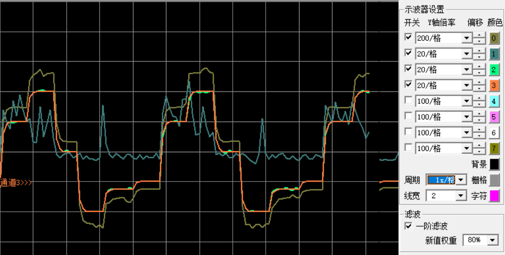

# 基于STM32的直流电机串级角度控制
## 目录
[TOC]

## 前期准备

### 材料准备

* 控制板

  使用先前购买的STM32F407工控板

  CPU频率可达168MHZ，硬件资源丰富

  这里需要使用的硬件资源：

  > 串口UART1、系统定时器SysTick(RTOS)、通用定时器TIM14(输出PWM)、模数转换器ADC1(检测电流与角度)、通用定时器TIM2、TIM5(M测速)、独立看门狗IWDG

  

* 电源板

  使用MP1584EN可调电源降压模块，用于给电池降压给控制板提供5V电源(灵活选择)

  > 这里输入电池电压7.4V，输出调至5V，最大输出电流3A

  


* 电机驱动板BD6736

  其核心电路是桥式可逆PWM变换器，使用PWM信号驱动，支持电机正反转

  > 输入电压支持2-9V，可输出1A电流

  

  

  

* 电机

  使用碳刷385直流电机

  > 适合电压5-12V，空载电流100ma
  >
  > 7.4V电压堵转电流约800ma
  >
  > 带AB相编码盘，可进行测速

  

* 打印件准备

  使用`solidworks`进行建模并打印相关固定件

  

  

* 其他

  * 电源  这里使用7.4V航模电池
  * ST-Link	控制板烧录程序
  * USB-TTL  串口通讯  （这里使用蓝牙串口）
  * 检流电阻  用于检测电机电流（这里使用0.5R 2W 1%）
  * 运算放大器  用于放大电流信号[7.8倍] （这里使用358 电阻68K 10K）
  * 实验板、杜邦线等

  


### 软件准备

* keil5

  用于编写代码程序

  > 需要下载STM32芯片包
  >
  > 需要修改宏定义，添加头文件地址等


* 串口猎人

  用来进行串口调试


 ### 技术准备

  * 官方库的移植

    > 移植细节参考网上资料，不再赘述
    >
    > 需要注意依据板子修改部分代码：依据晶振大小修改时钟宏定义(这里是8MHZ)
    
    
    
    
    
    

  * FreeRTOS移植

    > 移植过程参考网上资料，这里使用V9.0.0版本
    >
    > 注意在中断文件中注释相关中断函数，供FreeRTOS使用

    

    

    在FreeRTOSConfig.h中修改宏定义

    > 添加宏定义、配置系统时钟、修改内存相关配置等

    * 添加编译器相关宏

      ```c
      //针对不同编译器调用不同的stdint.h文件
      #if defined(__ICCARM__) || defined(__CC_ARM) || defined(__GNUC__)
          #include <stdint.h>
          extern uint32_t SystemCoreClock;
      #endif
      ```

    * 修改系统时钟

      ```C
      #define configCPU_CLOCK_HZ					( SystemCoreClock )
      #define configTICK_RATE_HZ					( ( TickType_t ) 10000 )		//RTOS系统节拍中断的频率（一秒中断的次数）每次中断RTOS都会进行任务调度
      ```

    * 开启动态内存

      ```C
      #define configSUPPORT_DYNAMIC_ALLOCATION		1    //支持动态内存申请
      ```

    * 关闭钩子函数(这里没有使用他们)

      ```C
      #define configUSE_IDLE_HOOK				0	
      #define configUSE_TICK_HOOK				0			//xTaskIncrementTick函数是在xPortSysTickHandler中断函数中被调用的。因此，vApplicationTickHook()函数执行的时间必须很短才行
      #define configUSE_MALLOC_FAILED_HOOK	0			//使用内存申请失败钩子函数
      #define configCHECK_FOR_STACK_OVERFLOW	0
      ```

  * STM32F4外设学习

    > GPIO口控制
    >
    > 定时器使用（定时、正交编码、PWM输出）
    >
    > ADC使用
    >
    > 中断
    >
    > 串口通讯
    >
    > 看门狗
    >
    > *具体内容请参考网上资料*


### 理论准备

+ PID控制
  > PID是基于反馈控制的常用算法，适用于大部分控制场合

  **P比例**：比例项可以成比例地反映控制系统的偏差信号，一旦产生偏差就立即产生控制作用以减小偏差。比例系数越大控制作用越强，但易产生超调与振荡，属于有差调节。

  **I积分**：积分项可以累计误差作为输出，属于无差调节，只有误差为零时才会维持输出不变，一般与P合用构成最常用的控制器，但应注意积分饱和问题。

  **D微分**：微分项能反映偏差信号的变化趋势，能在偏差信号的值变得太大之前在系统中引入一个早期修正信号，减小系统调节时间，一般作为PI控制器的修正，但因注意高频噪声干扰。

* 串级控制

  > 在普通反馈控制结构中引入一个内环控制
  >
  > 可以提高系统抗扰能力、改善动态性能、提高鲁棒性
  
  **内环**起到粗调和快速抵抗干扰的作用，可以改善系统的动态性能增大主控制器增益，提高系统频率，一般只使用比例控制。
  
  **外环**起到细调的作用，主控制器输出作为内环的给定。
  
  

+ 电机拖动

  > 主要涉及直流电机调速
  >
  > 这里使用永磁式直流电机，使用调压调速

  根据直流电机稳态公式$n=\frac{U-IR}{K_{e}\Phi} $得出，当磁通$\Phi$、电阻$R$不变时调节电枢回路电压可以改变转子转速

  

  在电流过大时引入电流负反馈，可以增加系统稳定性，减少电机堵转带来的大电流

  

+ 同相放大器

  > 使用同相放大器将电流采样电阻电压进行放大，方便单片机进行读取
  >
  > 放大倍数为7.8倍

  放大倍数为$1+\frac{R_1}{R_2}$倍

  

+ M法测速

  > 基于电机AB相编码盘，使用定时器计数功能进行边沿计数，进而测得速度

  使用通用定时器TIM2进行计数，通用定时器TIM5发射采样脉冲，可以测得采样周期内电机速度


+ 任务系统

  基于FreeRTOS实时操作系统进行任务调度和CPU等资源管理，提高系统实时性和利用率
  
  
## 设计过程

### 硬件连接


### MCU资源配置

+ GPIO口分配

  > GPIOA挂载载AHB1时钟总线上,使用时需要打开AHB1时钟总线

  | GPIOX_Pin_X  |      用途      |
  | ------------ | :------------: |
  | GPIOA_Pin_6  |   LED指示灯    |
  | GPIOA_Pin_9  |   串口通讯TX   |
  | GPIOA_Pin_10 |   串口通讯RX   |
  | GPIOA_Pin_0  |  正交编码A相   |
  | GPIOA_Pin_1  |  正交编码B相   |
  | GPIOA_Pin_5  | 电机正反转控制 |
  | GPIOA_Pin_7  |  电机PWM输出   |
  | GPIOA_Pin_2  | AD转换读取角度 |
  | GPIOA_Pin_4  | AD转换读取电流 |
  |              |                |

+ 定时器分配

  + 系统定时器SysTick

    > 提供系统节拍给FreeRTOS,在使用FreeRTOS时自动启动

    下图为FreeRTOS中提供的中断函数，用户不需要配置

    
    
  + 通用定时器TIM2

    > 使用TIM2计数模式记录电机编码盘脉冲，硬件内部具备AB相检测功能

    配置函数如下：

    ```C
    void Encoder_Init_TIM2(void)
    {
        TIM_TimeBaseInitTypeDef TIM_TimeBaseStructure;
        GPIO_InitTypeDef GPIO_InitStructure;
        //打开定时器TIM2与GPIOA的时钟
        RCC_APB1PeriphClockCmd(RCC_APB1Periph_TIM2, ENABLE);
        RCC_AHB1PeriphClockCmd(RCC_AHB1Periph_GPIOA, ENABLE);
    	GPIO_PinAFConfig(GPIOA,GPIO_PinSource0,GPIO_AF_TIM2); //复用功能
    	GPIO_PinAFConfig(GPIOA,GPIO_PinSource1,GPIO_AF_TIM2);
    	//引脚配置
    	GPIO_InitStructure.GPIO_Pin = GPIO_Pin_0|GPIO_Pin_1;    
    	GPIO_InitStructure.GPIO_Mode = GPIO_Mode_AF;    //复用   
    	GPIO_InitStructure.GPIO_Speed = GPIO_High_Speed;
    	GPIO_InitStructure.GPIO_OType = GPIO_OType_PP;
    	GPIO_InitStructure.GPIO_PuPd = GPIO_PuPd_NOPULL; 
      	GPIO_Init(GPIOA, &GPIO_InitStructure);                       
      	TIM_TimeBaseStructInit(&TIM_TimeBaseStructure);
      	TIM_TimeBaseStructure.TIM_Prescaler = 0x0; // 预分频
      	TIM_TimeBaseStructure.TIM_Period = ARR_ENCODE; //自动重装值
      	TIM_TimeBaseStructure.TIM_ClockDivision = TIM_CKD_DIV1;//不分频
      	TIM_TimeBaseStructure.TIM_CounterMode = TIM_CounterMode_Up;//TIM向上计数
      	TIM_TimeBaseInit(TIM2, &TIM_TimeBaseStructure);
      	TIM_EncoderInterfaceConfig(TIM2, TIM_EncoderMode_TI12, 		TIM_ICPolarity_Rising, TIM_ICPolarity_Rising);//使用编码器模式3
        TIM_ICInitTypeDef TIM_ICInitStructure;
      	TIM_ICStructInit(&TIM_ICInitStructure);
      	TIM_ICInitStructure.TIM_ICFilter = 0x8;
      	TIM_ICInit(TIM2, &TIM_ICInitStructure);
      	TIM_SetCounter(TIM2,0);	TIM_Cmd(TIM2, ENABLE);
    }
    ```
    
  + 通用定时器TIM5
  
    > 发出计数脉冲，产生计数中断
  
    定时器配置函数如下：
  
    ```C
    static void TIM_Mode_Config(void)
    {
    	TIM_TimeBaseInitTypeDef  TIM_TimeBaseStructure;
    	// 此处默认通用定时器时钟源TIMxCLK = HCLK/2=84MHz 
      	RCC_APB1PeriphClockCmd(GENERAL_TIM_CLK, ENABLE);//打开定时器时钟源
        TIM_TimeBaseStructure.TIM_Prescaler = 8400-1;	//配置预分频系数，定时器频率TIMxCLK/(TIM_Prescaler+1)=10000Hz
    	TIM_TimeBaseStructure.TIM_CounterMode=TIM_CounterMode_Up;// 向上计数方式
      	TIM_TimeBaseStructure.TIM_Period = 20-1; //配置自动装载值，累计 TIM_Period个后产生一个更新或者中断 	
      	TIM_TimeBaseStructure.TIM_ClockDivision=TIM_CKD_DIV1;// 输入捕获
    	TIM_TimeBaseInit(GENERAL_TIM, &TIM_TimeBaseStructure);//初始化定时器
    	TIM_ClearFlag(GENERAL_TIM, TIM_FLAG_Update);// 清除定时器更新中断标志位
    	TIM_ITConfig(GENERAL_TIM,TIM_IT_Update,ENABLE);// 开启定时器更新中断
    	TIM_Cmd(GENERAL_TIM, ENABLE);	// 使能定时器
    }
    ```
    
    中断配置时应注意中断组不因设置，因FreeRTOS统一调度问题，中断组已提前设置好，详见`main.c`文件中`BSP_Init(void)`函数
    
    中断配置函数如下：
  
    ```C
    static void TIMx_NVIC_Configuration(void)
    {
        NVIC_InitTypeDef NVIC_InitStructure; 
        //NVIC_PriorityGroupConfig(NVIC_PriorityGroup_0);// 设置中断组为0
        NVIC_InitStructure.NVIC_IRQChannel = GENERAL_TIM_IRQn; // 设置中断来源
        NVIC_InitStructure.NVIC_IRQChannelPreemptionPriority = 0;	// 设置抢占优先级
        NVIC_InitStructure.NVIC_IRQChannelSubPriority = 3;// 设置子优先级	
        NVIC_InitStructure.NVIC_IRQChannelCmd = ENABLE;
        NVIC_Init(&NVIC_InitStructure);
    }
    ```
    
    中断调用函数见`stm32f4xx_it.c`文件中，注意判断中断类型和标志位清除
    
    中断代码如下：
  
    ```C
    void  GENERAL_TIM_IRQHandler (void)
    {
    	uint32_t ulReturn;
      ulReturn = taskENTER_CRITICAL_FROM_ISR();//进入临界段，临界段可嵌套
    	if ( TIM_GetITStatus( GENERAL_TIM, TIM_IT_Update) != RESET ) //判断中断类型
    	{	
    		TIM_ClearITPendingBit(GENERAL_TIM , TIM_IT_Update); //清除中断标志 
    		Read_Encoder();//读取电机速度
    	}		 	
    	taskEXIT_CRITICAL_FROM_ISR(ulReturn);
    }
    ```
    
    
    
  + 通用定时器TIM14
  
    > 使用TIM14输出PWM信号控制电机电压，使用Channel1
  
    配置函数如下：
  
    ```C
    static void TIM14_PWM_Init()
    {		 					 	
    	TIM_TimeBaseInitTypeDef  TIM_TimeBaseStructure;
    	TIM_OCInitTypeDef  TIM_OCInitStructure;
    	RCC_APB1PeriphClockCmd(RCC_APB1Periph_TIM14,ENABLE);  
    	
    	TIM_TimeBaseStructure.TIM_Prescaler=PSC_PWM;  //定时器分频
    	TIM_TimeBaseStructure.TIM_CounterMode=TIM_CounterMode_Up; //向上计数模式
    	TIM_TimeBaseStructure.TIM_Period=ARR_PWM;   //自动重装载值
    	TIM_TimeBaseStructure.TIM_ClockDivision=TIM_CKD_DIV1; 
    	TIM_TimeBaseInit(TIM14,&TIM_TimeBaseStructure);//初始化定时器14
    	//初始化TIM14 Channel1 PWM模式	 
    	TIM_OCInitStructure.TIM_OCMode = TIM_OCMode_PWM1; //选择定时器模式:TIM脉冲宽度调制模式2
     	TIM_OCInitStructure.TIM_OutputState = TIM_OutputState_Enable; //比较输出使能
    	TIM_OCInitStructure.TIM_OCPolarity = TIM_OCPolarity_High; //输出极性:TIM输出比较极性高
    	TIM_OC1Init(TIM14, &TIM_OCInitStructure);  //根据T指定的参数初始化外设TIM1 4OC1
    	TIM_OC1PreloadConfig(TIM14, TIM_OCPreload_Enable);  //使能TIM14在CCR1上的预装载寄存器
      	TIM_ARRPreloadConfig(TIM14,ENABLE);//ARPE使能 
    	TIM_Cmd(TIM14, ENABLE);  //使能TIM14
    } 
    ```
  
+ AD转换器分配

  + ADC1

    > 这里有两路模拟输入：电流、角度，均为电压值输入（<3.3V）
    >
    > 使用ADC1，使用通道2(角度)、通道4(电流)

    配置函数如下：

    ```C
    static void ADC_Mode_Config(void)
    {
    	ADC_InitTypeDef ADC_InitStructure;
      	ADC_CommonInitTypeDef ADC_CommonInitStructure;
    	RCC_APB2PeriphClockCmd(RCC_APB2Periph_ADC1, ENABLE);
    	ADC_DeInit();	//复位
      	ADC_CommonInitStructure.ADC_Mode = ADC_Mode_Independent;//独立模式
      	ADC_CommonInitStructure.ADC_TwoSamplingDelay = 			     ADC_TwoSamplingDelay_5Cycles;//两个采样阶段之间的延迟5个时钟
      	ADC_CommonInitStructure.ADC_DMAAccessMode = ADC_DMAAccessMode_Disabled; //DMA失能
      	ADC_CommonInitStructure.ADC_Prescaler = ADC_Prescaler_Div4;//预分频4分频。ADCCLK=PCLK2/4=84/4=21Mhz,ADC时钟最好不要超过36Mhz 
      	ADC_CommonInit(&ADC_CommonInitStructure);//初始化
      	ADC_InitStructure.ADC_Resolution = ADC_Resolution_12b;//12位模式
      	ADC_InitStructure.ADC_ScanConvMode = DISABLE;//非扫描模式	
      	ADC_InitStructure.ADC_ContinuousConvMode = DISABLE;//关闭连续转换
      	ADC_InitStructure.ADC_ExternalTrigConvEdge = 							ADC_ExternalTrigConvEdge_None;//禁触发检测，软件触发
      //ADC_InitStructure.ADC_ExternalTrigConv = ADC_ExternalTrigConv_T1_CC1;//外部触发通道（这里使用软件触发，随意）
        ADC_InitStructure.ADC_DataAlign = ADC_DataAlign_Right;//右对齐	
      	ADC_InitStructure.ADC_NbrOfConversion = 1;//1个转换在规则序列中 也就是只转换规则序列1 
      	ADC_Init(ADC1, &ADC_InitStructure);//ADC初始化
    	ADC_Cmd(ADC1, ENABLE);// 使能ADC
    }
    ```
  
+ 串口USART1分配

  GPIO口配置：
  
  ```C
  static void gpiousart()
  {
  	RCC_AHB1PeriphClockCmd(RCC_AHB1Periph_GPIOA,ENABLE);
  	GPIO_InitTypeDef gpio_init;
  
  	gpio_init.GPIO_Speed=GPIO_Fast_Speed;
  	gpio_init.GPIO_PuPd=GPIO_PuPd_UP;
  	gpio_init.GPIO_Mode=GPIO_Mode_AF;//复用模式
  	gpio_init.GPIO_OType=GPIO_OType_PP;//推挽输出
  	
  	gpio_init.GPIO_Pin=GPIO_Pin_9;//TX
  	GPIO_Init(GPIOA,&gpio_init);
  	gpio_init.GPIO_Pin=GPIO_Pin_10;//RX
  	GPIO_Init(GPIOA,&gpio_init);
  	
  	/* gpio复用 */
  	GPIO_PinAFConfig(GPIOA,GPIO_PinSource9,GPIO_AF_USART1);
  	GPIO_PinAFConfig(GPIOA,GPIO_PinSource10,GPIO_AF_USART1);
  }
  ```
  
  串口配置：
  
  ```C
  void usartinit()
  {
  	gpiousart();
  	
  	RCC_AHB1PeriphClockCmd(RCC_AHB1Periph_GPIOA,ENABLE);
  	RCC_APB2PeriphClockCmd(RCC_APB2Periph_USART1, ENABLE);
    	USART_InitTypeDef USART_InitStructure;
    	USART_InitStructure.USART_BaudRate = 115200;//波特率
    	USART_InitStructure.USART_WordLength = USART_WordLength_8b;//字长8位
    	USART_InitStructure.USART_StopBits = USART_StopBits_1;//停止位1位
    	USART_InitStructure.USART_Parity = USART_Parity_No;//不校验
    	USART_InitStructure.USART_HardwareFlowControl = USART_HardwareFlowControl_None;//不用硬件流
    	USART_InitStructure.USART_Mode = USART_Mode_Rx | USART_Mode_Tx;//usart模式RX+TX
    	USART_Init(USART1, &USART_InitStructure); //初始化
  	#if EN_USART1_RX	
  	nvicinit();//中断配置
  	USART_ITConfig(USART1, USART_IT_RXNE, ENABLE);//使能串口接收中断
  	#endif
    	USART_Cmd(USART1, ENABLE);//使能串口
  }
  ```
  
  中断配置：
  
  ```C
  static void nvicinit(void)
  {
    NVIC_InitTypeDef NVIC_InitStructure;
    NVIC_InitStructure.NVIC_IRQChannel = USART1_IRQn;//中断源
    NVIC_InitStructure.NVIC_IRQChannelPreemptionPriority = 3;
    NVIC_InitStructure.NVIC_IRQChannelSubPriority = 3;
    NVIC_InitStructure.NVIC_IRQChannelCmd = ENABLE;
    NVIC_Init(&NVIC_InitStructure);
  }
  ```

### 软件设计

+ 数据结构

  > 结构体system_msg定义在app.h文件中
  >
  > 结构体pid_msg定义在pid.h文件中

  | 数据类型    |    变量名    | 用途             |
  | ----------- | :----------: | ---------------- |
  | system_msg  |   sys_msg    | 电机参数         |
  | system_flag |   sys_flag   | 系统状态信号     |
  | pid_msg     | pid_motspeed | 电机速度环(内环) |
  | pid_msg     |  pid_motang  | 电机角度环(外环) |

  system_msg结构体：

  ```C
  struct system_msg
  {
  	int16_t mot_pwm;	//给定PWM
  	int16_t mot_speed;//实际速度
  	float mot_ang;	//实际角度
  	u16 mot_Ama;		//实际电流
  	int16_t mot_tag_speed;	//目标速度
  	float mot_tag_ang;	//目标角度
  	u16 dead_A;//堵转电流
  };
  ```
  
  pid_msg结构体：
  
  ```C
  struct pid_msg {
  	float SetSpeed;	//目标
  	float ActualSpeed;	//实际
  	float output;//输出值
  	
  	float Err; 	//误差值
  	float Err_last;	//上次误差值
  	float Err_llast;//上上次误差
  	float output_last; //上次输出值
  	float Kp, Ki, Kd;	
  };
  ```
  
  
  
+ 宏定义

  | 宏名称      |  值  | 用途         |
  | ----------- | :--: | ------------ |
  | DEAD_PWM    | 1000 | PWM输出限制  |
  | DEAD_SPEED  |  80  | 电机速度限制 |
  | DE_ANG_DOWN |  0   | 角度下限     |
  | DE_ANG_UP   | 235  | 角度上限     |

+ 串口通讯协议

  > 帧头A5，帧尾AA，定义在usart.h中
  >

  | 功能位 | 用途 |      说明      |
  | ------ | ---- | :------------: |
  | 0x01   | 接收 | 上位机给定角度 |
  | 0x01   | 上传 |   输出PWM值    |
  | 0x02   | 上传 |    电机电流    |
  | 0x03   | 上传 |  电机实际速度  |
  | 0x04   | 上传 |  电机给定速度  |
  | 0x05   | 上传 |  电机实际角度  |
  | 0x06   | 上传 |  电机给定角度  |

## 主要代码

### 任务构建

1. 初始化与任务构建

  + int main(void);

    > 首先进行板卡初始化，初始化硬件设施
    >
    > 然后新建AppTaskCreate任务，在此任务中创建其他任务
    >
    > 最后启动任务调度。

    板卡初始化：
    
    ```C
    static void BSP_Init(void)
    {
    	//中断优先级分组为4(4bit都用来表示抢占优先级,范围:0~15),不要再次分组!!
    	NVIC_PriorityGroupConfig( NVIC_PriorityGroup_4 );
    	led_inint();
    	GPIO_OLED_InitConfig();
    	usartinit();
    	THE_ADC_Init();
    	PWM_Init();  
    	TIMx_Configuration();
    	config_motor();
    	PID_Init();
    	IWDG_Config(IWDG_Prescaler_64 ,625);//看门狗1s
    	printf("This is STM32F4 and FreeRTOS\r\n");
    	//OLED_Clear();
    	//OLED_ShowString(0,0,"This is RTOS");
    }
    ```
    
  + static void AppTaskCreate(void);
  
    > 创建任务
    >
    > SpeedPID_Task：速度环任务
    >
    > AngPID_Task：角度环任务
    >
    > Iwdg_Task：看门狗任务
    >
    > Usarttx_Task：串口传输任务
  
    首先进入临界区，不进行任务调度，防止任务切换

    ```C
    taskENTER_CRITICAL();      //进入临界区
    ```
  
    然后新建四个任务，分配资源和优先级
  
    最后删除AppTaskCreate任务，退出临界区
  
    ```C
    vTaskDelete(AppTaskCreate_Handle); //删除AppTaskCreate任务
    taskEXIT_CRITICAL();            //退出临界区
    ```

2. 角度环任务
    > 通过AD转换读取角度，进行PID运算得出***给定速度***

    ```C
    static void AngPID_Task(void* parameter)
    {
        TickType_t xLastWakeTime;
    	sys_msg.mot_tag_ang=(int)DE_ANG_UP/2;
    	while (1)
    	{
    		vTaskDelayUntil(&xLastWakeTime,50);
    		sys_msg.mot_ang=((double) GetAng_ADC()/(double)4096*270)-30;//读取角度
    sys_msg.mot_tag_speed=PID_Cal(&pid_motang,sys_msg.mot_tag_ang,sys_msg.mot_ang,DEAD_SPEED,(-DEAD_SPEED));//PID输出角度
    	}
    }

3. 速度环任务

   >根据电机速度与外环给定值进行PID运算得出***输出PWM***

   ```C
     static void SpeedPID_Task(void* parameter)
     {	   
     	TickType_t xLastWakeTime;
     	while (1)
     	{
     		vTaskDelayUntil(&xLastWakeTime,10);
     		sys_msg.mot_Ama =(double)2000/7.8*((double) GetA_ADC()/(double)4096*3.3); // 读取电流MA
           sys_msg.mot_pwm=PID_Cal(&pid_motspeed,sys_msg.mot_tag_speed,sys_msg.mot_speed,DEAD_PWM,(-DEAD_PWM));//PID速度
           set_pwm(sys_msg.mot_pwm);	//修改占空比
     	}
     }
   ```

4. 看门狗任务

    > 进行***定时喂狗***
    
    ```C
    static void Iwdg_Task(void* parameter)
    {	
    	while (1)
    	{
    		vTaskDelay(5000);
    		GPIO_ToggleBits(GPIOA,GPIO_Pin_6);//指示灯
    		IWDG_Feed();
    	}
    }
    ```

5. 串口数据发送任务

   > 上传数据给上位机，方便数据可视化

   ```C
   static void Usarttx_Task(void* parameter)
   {	
   	while (1)
   	{
   		vTaskDelay(80);
   		Usart_Dataframe( 0x01, sys_msg.mot_pwm);
   		Usart_Dataframe( 0x02, sys_msg.mot_A10ma);
   		Usart_Dataframe( 0x03, sys_msg.mot_speed);
   		Usart_Dataframe( 0x04, sys_msg.mot_tag_speed);
   		Usart_Dataframe( 0x05, sys_msg.mot_ang);
   		Usart_Dataframe( 0x06, sys_msg.mot_tag_ang);
   	}
   }
   ```

### PID算法

> 这里使用增量式PID算法，包含输出上下限控制

增量PID公式：

$$
\Delta u(k)=K_p[e(k)-e(k-1)]+K_ie(k)+K_d[e(k)-2e(k-1)+e(k-2)]
$$
PID结构体如下：

```C
struct pid_msg {
	float SetSpeed;	//目标
	float ActualSpeed;	//实际
	float output;//输出值
	
	float Err; 	//误差值
	float Err_last;	//上次误差值
	float Err_llast;//上上次误差
	float output_last; //上次输出值
	float Kp, Ki, Kd;	
};
```

PID参数：

```C
void PID_Init() 
{
	pid_motspeed.Kp = 25;
	pid_motspeed.Ki = 0;
	pid_motspeed.Kd = 0;
	
	pid_motang.Kp = 2;
	pid_motang.Ki = 0.3;
	pid_motang.Kd = 0.04;
}
```

PID控制函数：

```C
int16_t PID_Cal(struct pid_msg * pid_mot,int16_t tag,int16_t act,int16_t deadup,int16_t deaddown)
{
	pid_mot->ActualSpeed=act;	//实际值
	pid_mot->SetSpeed = tag;	//目标值
	pid_mot->Err = pid_mot->SetSpeed - pid_mot->ActualSpeed;	//本次误差
	pid_mot->output = pid_mot->output_last + \
										pid_mot->Kp*(pid_mot->Err-pid_mot->Err_last) + \
										pid_mot->Ki*pid_mot->Err + \
										pid_mot->Kd*(pid_mot->Err - 2*pid_mot->Err_last + pid_mot->Err_llast);//根据增量型PID控制的公式
	//上下限死区设置
	if(pid_mot->output>deadup)
		pid_mot->output=deadup;
	if(pid_mot->output<deaddown)
		pid_mot->output=deaddown;
	pid_mot->output_last=pid_mot->output;//更新上次输出值
	pid_mot->Err_llast=pid_mot->Err_last;	//更新上上次误差
	pid_mot->Err_last = pid_mot->Err;	//更新上次误差
	return pid_mot->output;//PID的输出
}
```


### 串口通讯

1. 编写数据发送函数

   + 单字节发送

     ```C
     /*发送一个字符*/
     void Usart_SendByte( USART_TypeDef * pUSARTx, uint8_t ch)
     {
     	USART_SendData(pUSARTx,ch);//串口+数据
     	while (USART_GetFlagStatus(pUSARTx, USART_FLAG_TXE) == 0);//等待发送数据寄存器为空
     }
     ```

   + 双字节数据发送

     ```C
     void Usart_SendHalfWord( USART_TypeDef * pUSARTx, uint16_t ch)
     {
     	uint8_t temp_h, temp_l;
     	/* 取出高八位 */
     	temp_h = (ch&0XFF00)>>8;
     	/* 取出低八位 */
     	temp_l = ch&0XFF;
     	/* 发送高八位 */
     	USART_SendData(pUSARTx,temp_h);	
     	while (USART_GetFlagStatus(pUSARTx, USART_FLAG_TXE) == 0);
     	/* 发送低八位 */
     	USART_SendData(pUSARTx,temp_l);	
     	while (USART_GetFlagStatus(pUSARTx, USART_FLAG_TXE) == 0);	
     }
     ```
     
   + 数据帧发送函数
   
     ```c
     void Usart_Dataframe(uint8_t control,uint16_t data)
     {
     	Usart_SendByte( USART1, FRA_HEAD);
     	Usart_SendByte( USART1, control);
     	Usart_SendHalfWord( USART1, data);
     	Usart_SendByte( USART1, FRA_END);
     }
     ```
   
2. 重写`printf、scanf`函数

   ```	C
   ///重定向c库函数printf到串口，重定向后可使用printf函数
   int fputc(int ch, FILE *f)
   {
   		//发送一个字节数据到串口
   		USART_SendData(USART1, (uint8_t) ch);
   		//等待发送完毕
   		while (USART_GetFlagStatus(USART1, USART_FLAG_TXE) == RESET);	
   		return (ch);
   }
   ```
   
   ```c
   ///重定向c库函数scanf到串口，重写向后可使用scanf、getchar等函数
   int fgetc(FILE *f)
   {
   		//等待串口输入数据
   		while (USART_GetFlagStatus(USART1, USART_FLAG_RXNE) == RESET);
   		return (int)USART_ReceiveData(USART1);
   }
   ```
   
3. 编写中断处理函数

   > 中断函数写在stm32f4xx.h文件中

   ```C
   //串口1中断
   void eat_msg(uint8_t *res,uint8_t max);
   #define Max_BUFF_Len 5
   uint8_t Uart2_Buffer[Max_BUFF_Len];
   uint8_t Uart2_Rx=0;
   void USART1_IRQHandler(void)
   {
   	//taskENTER_CRITICAL_FROM_ISR();//进入临界
   	//USART_GetITStatus(USART2, USART_IT_IDLE) != RESET//查询是否空中断
       if(USART_GetITStatus(USART1, USART_IT_RXNE) != RESET)//查询是否接收中断
       {  
           Uart2_Buffer[Uart2_Rx] = USART_ReceiveData(USART1);     //接收串口数据到buff缓冲区
           Uart2_Rx++;
           if(Uart2_Buffer[Uart2_Rx-1] == FRA_END)    //接收到尾标识
           {
               if(Uart2_Buffer[0] == FRA_HEAD)   //检测到头标识
               {
                   //printf("%s",Uart2_Buffer); 
                   eat_msg(Uart2_Buffer,Uart2_Rx);//处理之
                   Uart2_Rx=0;                                   
               } 
               else
               {
                   Uart2_Rx=0;     
               }
           }
           else if(Uart2_Rx == Max_BUFF_Len)//超出最大限额
           {
   			Uart2_Rx=0;
           }
   	}
       //taskEXIT_CRITICAL_FROM_ISR(0);  
   }
   ```
   
   其中`eat_msg(Uart2_Buffer,Uart2_Rx)`函数用来进行功能帧解析
   
   ```C
   void eat_msg(uint8_t *res,uint8_t max)
   {
   	if(max>=5)
   	{
   		int16_t data = (*((u16 *)(res+2)));
   		if(res[1]==0x01)//设置目标角度
   		{
   			if(data<DE_ANG_DOWN)	data=DE_ANG_DOWN;
   			if(data>DE_ANG_UP)		data=DE_ANG_UP;
   			sys_flag.own_flag=0;
   			sys_msg.mot_tag_ang=data;
   		}
   	}
   }
   ```
   
4. 上位机设置

   + 基本设置

     

   + 收码设置

     

## 实际效果

+ 速度控制曲线

  此为上位机给定速度时电机各参数的响应，可以看到电机实际速度可以较快跟踪给定值，略有超调，速度控制较为迅速。其中电流曲线有一定的波纹，可能由机械摩擦或外界给检测电路带来的干扰造成，可以使用高精度检测电阻和软件滤波改善。此外可以看到速度大小、PWM输出、电流大小等参数成较高的正相关性，与事实相符。

  

  

+ 角度控制曲线

  此为上位机给定角度时电机各参数的响应，可以看到电机实际角度可以跟踪给定角度，几乎无超调，但在角度呈加速变化时时实际响应具有较大残差，可能是最高电压过低所导致，可以更换12V电源改善。
  
  此外可以看到给定角度、实际角度、输出PWM、给定速度、电流等参数有较高的相关性，符合事实预期。但由于速度内环在此处只是用了比例调节，所以实际速度并未跟踪给定速度。
  
  

## 分析与改进

### 性能改善

* 改善任务调度周期

  先前代码中任务阻塞延时函数使用的是`vTaskDelay(time)`，该函数运行时会阻塞当前任务并启动任务调度，待其他任务进入阻塞态且延时达到`time`个周期时才调用该任务。可认为此函数是阻塞**相对时长**。

  改善后使用`vTaskDelayUntil(&xLastWakeTime,time)`函数，该函数运行时同样会阻塞当前任务并启动任务调度，当`time`个周期后无论是否有任务在运行都会启动任务调动（依据优先级调度）。可认为此函数是阻塞**绝对时长**。

  改善任务调度相关代码后，控制器的运行周期稳定性得到提高，控制效果提升。

* 简化任务代码

  先前的任务中使用了OLED屏幕作为数据显示，但增大了CUP开销，后改为使用串口进行上位机显示，系统响应速度极大提高了。
  
* 电流滤波

  如果需要较为精确的电流检测，可以使用平均值滤波或者中值滤波。

### 随动测试

> 系统中接入MPU6050陀螺仪作为角度给定值
>
> 使用I^2^C通讯

+ 添加角度获取任务

  由于MPU6050初始化时使用了系统延时，所以在此任务中初始化MPU6050，而不是在板卡初始化时初始化。

  ```C
  static void Ang_Task(void* parameter)
  {
  	sys_flag.own_flag=1;
  	float ang;
  	float pitch,roll,yaw; 		//欧拉角
  	short aacx,aacy,aacz;		//加速度传感器原始数据
  	short gyrox,gyroy,gyroz;	//陀螺仪原始数据
  	MPU_Init();	//调用了系统延时，必须在任务中进行
  	while(mpu_dmp_init());
  	while (1)
  	{
  		vTaskDelay(10);
  		if(sys_flag.own_flag==1)
  		{
  			if(mpu_dmp_get_data(&pitch,&roll,&yaw)==0)
  			{
  				//temp=MPU_Get_Temperature();	//得到温度值
  				MPU_Get_Accelerometer(&aacx,&aacy,&aacz);	//加速度
  				MPU_Get_Gyroscope(&gyrox,&gyroy,&gyroz);	//得到陀螺仪数据
  				ang=roll+(float)DE_ANG_UP/2;
  				if (ang<DE_ANG_DOWN)	ang=DE_ANG_DOWN;
  				if (ang>DE_ANG_UP)		ang=DE_ANG_UP;
  				sys_msg.mot_tag_ang=ang;
  			}
  		}
  	}
  }
  ```
  
  MPU6050具体代码见`mpu6050.c` 、`i2c.c`、`inv_mpu.c`、`inv_mpu_dmp_motion_driver.c`文件。

  其中`inv_mpu.c`、`inv_mpu_dmp_motion_driver.c`由厂商给出并进行相应移植后加入工程，具体移植过程参考网上内容。

+ 测试效果

  此为陀螺仪给定角度时电机各参数的响应，可以看到实际角度跟踪了陀螺仪给定角度，但在给定值突变或变化较快时角度跟踪效果不佳，可能由于电池电压不够12V、滑动电阻器精度不够、电机摩擦较大等因素有关。
  
  

## 其他说明
  项目中使用了OLED屏幕作为辅助调试，使用I^2^C协议通讯，占用了PE7\PE8端口，具体代码见`oled.c`文件，若不使用请注释相关函数。


  

  
